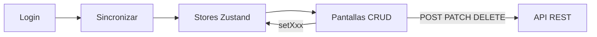
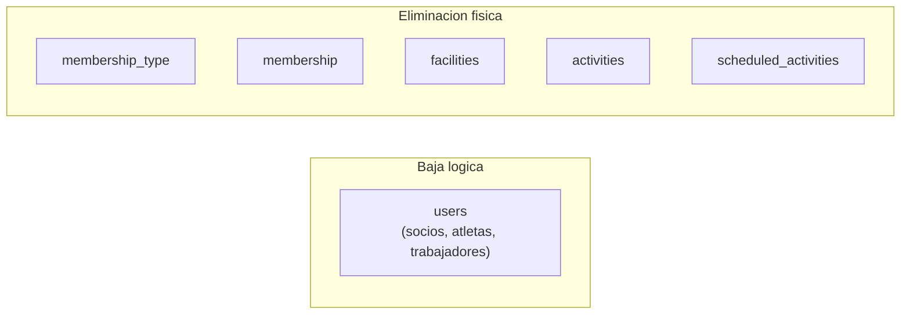

# proyecto-club-user-interface

Interfaz web (SPA) para la gestión de un club deportivo — Club Peñarol. Permite administrar trabajadores, socios, atletas, instalaciones, membresías, reservas puntuales, actividades rutinarias y reportes.

Consume la API REST del proyecto hermano **proyecto-club-api-rest** (NestJS + Prisma). La UI no tiene backend propio: autentica, sincroniza datos al store local y ejecuta operaciones CRUD contra el API.



---

## 1. Resumen de reglas de negocio

Este apartado resume **qué debe cumplir el sistema**. Las validaciones las aplica el backend; la UI las refleja en formularios Zod y mantiene el store local coherente tras cada mutación.

> Para validaciones campo a campo, matrices de propagación y glosario completo, ver [reglas_negocio.md](reglas_negocio.md).

### Principios transversales

- **Multi-tenancy por club:** cada club opera aislado. El club activo se determina por `VITE_CLUB_ID` en login, `useClubIdStore` (localStorage) y el header `X-Club-Id` en cada request.
- **IDs autogenerados:** el backend genera el `id` al crear. La UI no envía `id` en POST; lo recibe en la respuesta y lo persiste en el store.
- **Patrón CRUD:** mutación exitosa al API → actualizar store local con `setXxx()` / `updateXxx()` / `deleteXxx()`.
- **Eliminación en dos modalidades:**
  - **Baja lógica** (`users`): marca `isActive = false`, no borra el registro.
  - **Eliminación física** (tipos de membresía, membresías, instalaciones, reservas, actividades rutinarias): borra el registro.
- **Propagación local:** tras cada CRUD exitoso, la UI debe actualizar todas las navegaciones embebidas (`*Navigation`) en los stores relacionados, **sin llamadas adicionales al API**.



### Dominios principales

| Dominio | Ruta UI | API | Store |
|---------|---------|-----|-------|
| Tipos de membresía | `/tipos-membresia` | `/membership-type` | `useMembershipTypeStore` |
| Trabajadores | `/trabajadores` | `/users` (typeId = 1) | `useUserStore` |
| Miembros | `/miembros` | `/users` (typeId = 2, 3) | `useUserStore` |
| Membresías | `/membresias` | `/membership` | `useMembershipStore` |
| Instalaciones | `/instalaciones` | `/facilities` | `useFacilityStore` |
| Reservas | `/reservas` | `/activities` | `useActivityStore` |
| Actividades rutinarias | `/actividades-rutinarias` | `/scheduled-activities` | `useScheduledActivityStore` |

### Reglas por dominio

**Tipos de usuario**

| typeId | Rol | Ruta UI |
|--------|-----|---------|
| 1 | Trabajador — personal del club | `/trabajadores` |
| 2 | Socio — miembro estándar | `/miembros` |
| 3 | Atleta — miembro con datos deportivos y médicos | `/miembros` |

**Tipos de membresía** — Planes comerciales del club (nombre + precio ≥ 0). Se referencian en membresías activas, instalaciones y actividades rutinarias. Eliminación física.

**Usuarios (socios y atletas)** — Email y documento únicos por club. Al crear un socio o atleta, típicamente se crea también una membresía asociada. El atleta requiere campos adicionales: género, peso, altura, fecha de nacimiento, dieta, plan de entrenamiento, alergias, medicamentos y condiciones médicas. Eliminación = baja lógica (`isActive = false`).

**Trabajadores** — Personal del club con datos laborales: salario, horas diarias, horario de trabajo (`startWorkAt` < `endWorkAt`). Pueden ser responsables o asistentes en instalaciones, reservas y actividades rutinarias. Se asignan a instalaciones vía `POST /facility-workers`. Eliminación = baja lógica.

**Membresías** — Suscripción de un socio o atleta a un tipo de membresía. El vencimiento se calcula en backend: `expiration = createdAt + 30 días`. Eliminación física.

**Instalaciones** — Espacios físicos reservables. Capacidad mínima 4. Debe tener al menos un tipo de membresía habilitado. Puede tener trabajador responsable y asistentes. Eliminación física.

**Reservas** — Uso puntual de una instalación en fecha y horario concretos (en la API se llaman `activities`). Reglas críticas:
- `hourStart` debe ser anterior a `hourEnd`.
- No puede haber solapamiento horario en la misma instalación y fecha.
- Solo se eliminan reservas **no completadas** (cuando `date + hourEnd` ya pasó, el backend rechaza el DELETE).

**Actividades rutinarias** — Clases que se repiten semanalmente en una instalación, definidas por días de la semana y bloques horarios. Puede haber múltiples bloques en un mismo día. Misma regla de no solapamiento que las reservas, pero por `[facilityId, workingDayId]`. Eliminación física.

### Restricciones críticas

| Entidad | Restricción | Alcance |
|---------|-------------|---------|
| `users.document` | Único | Por `[clubId, document]` |
| `users.email` | Único | Por `[clubId, email]` |
| Reservas | Sin solapamiento horario | Misma `[facilityId, date]` |
| Actividades rutinarias | Sin solapamiento horario | Misma `[facilityId, workingDayId]` |
| Asignación trabajador-instalación | Sin duplicados | `[facilityId, userId, clubId, userTypeId]` |

Detección de solapamiento: `(hourStart_A < hourEnd_B) AND (hourStart_B < hourEnd_A)`.

---

## 2. Stack tecnológico

| Capa | Tecnología | Notas |
|------|------------|-------|
| Runtime | Node.js 24.13.1 | Ver `.nvmrc` |
| Lenguaje | TypeScript ~5.9 | Strict mode, ESM |
| UI | React 19 + React DOM | |
| Build / dev | Vite 7 | Plugin `@vitejs/plugin-react` |
| Routing | react-router-dom 7 | `BrowserRouter` en `src/main.tsx` |
| Estado global | Zustand 5 | Middleware `persist` (localStorage / sessionStorage) |
| HTTP | Axios 1.13 | Cliente en `src/config/axios.ts` |
| Formularios | react-hook-form 7 | |
| Validación | Zod 4 + @hookform/resolvers | Schemas en formularios |
| Estilos | Bootstrap 5 + Tailwind CSS 4 | Bootstrap Icons vía CDN |
| Gráficos | Chart.js + react-chartjs-2 | Módulo de reportes |
| Lint | ESLint 9 | Flat config (`eslint.config.js`) |

### Variables de entorno

Definidas en `.env`:

| Variable | Uso |
|----------|-----|
| `VITE_API_URL` | URL base del API REST (ej. `https://proyecto-club-api-rest.onrender.com`) |
| `VITE_CLUB_ID` | ID del club enviado en el login |

### Lo que el proyecto no utiliza

Redux, React Query, SWR, capa `services/` dedicada, SSR, ni suite de tests automatizados.

### Comandos de desarrollo

```bash
nvm use          # Node 24.13.1
npm install
npm run dev      # servidor local Vite
npm run build    # build de producción
npm run lint     # ESLint
npm run preview  # preview del build
```

---

## 3. Arquitectura del sistema

> Para detalle técnico de stores, interfaces TypeScript y checklist para nuevos features, ver [arquitectura_sistema.md](arquitectura_sistema.md).

### 3.1 Patrón de datos

1. **Login** — El usuario ingresa email y contraseña. `POST /auth/login` devuelve JWT y `clubId`. Se persisten en `useAuthStore` (sessionStorage) y `useClubIdStore` (localStorage).
2. **Sincronización** — La pantalla `/sincronizar` ejecuta 8 GET en paralelo y hidrata todos los stores Zustand con los datos del club.
3. **Consulta** — Los listados leen directamente del store local (sin llamadas al API en cada navegación).
4. **Mutación** — Los formularios envían POST / PATCH / DELETE al API y, si la respuesta es exitosa, actualizan el store manualmente.
5. **Wizards multi-paso** — Formularios de creación/edición complejos guardan estado intermedio en stores `useCreate*Store` / `useEdit*Store` hasta armar el DTO final.

```
main.tsx → AppRouter → Pages → Components
                ↓           ↓
           Zustand stores ← Axios → API REST
                ↓
           Entities.ts (tipos)
```

### 3.2 Estructura de carpetas

```
src/
├── main.tsx                # Bootstrap: React root, BrowserRouter, branding
├── App.tsx                 # Shell mínimo → AppRouter
├── router/AppRouter.tsx    # Todas las rutas + ProtectedRoute
├── config/axios.ts         # Cliente HTTP + interceptores (Bearer, X-Club-Id)
├── store/store.ts          # Todos los stores Zustand
├── entities/Entities.ts    # ~45 interfaces TypeScript del dominio
├── pages/                  # Contenedores por ruta (orquestación)
├── components/             # Formularios, listas, reportes, Navbar
└── theme/clubBranding.ts   # Variables CSS del club
```

**Convención:** las **pages** leen stores y definen el layout de ruta; los **components** contienen formularios, tablas y la lógica de submit contra el API.

### 3.3 Módulos de la interfaz

Cada módulo agrupa rutas relacionadas. Las rutas protegidas requieren token JWT (`ProtectedRoute` en `AppRouter.tsx`). Sin token → redirect a `/login`.

---

#### Autenticación y sincronización

**Qué hace:** gestiona el acceso al sistema y la carga inicial de datos del club.

| Ruta | Pantalla | Qué hace | Endpoint |
|------|----------|----------|----------|
| `/login` | `Login` | Formulario de inicio de sesión | `POST /auth/login` |
| `/sincronizar` | `Sync` | Carga masiva de datos al store | 8× GET (ver sync abajo) |
| `/home` | `Home` | Pantalla de bienvenida | — |
| `/` | redirect | → `/home` (autenticado) o `/login` | — |

**Sync — GET paralelos** (todos con `?clubId=`):

| Endpoint | Store destino |
|----------|---------------|
| `GET /membership-type?clubId=` | `useMembershipTypeStore` |
| `GET /membership?clubId=` | `useMembershipStore` |
| `GET /activities?clubId=` | `useActivityStore` |
| `GET /user-type?clubId=` | `useUserTypeStore` |
| `GET /facilities?clubId=` | `useFacilityStore` |
| `GET /users?clubId=` | `useUserStore` |
| `GET /scheduled-activities?clubId=` | `useScheduledActivityStore` |
| `GET /scheduled-activities/working-days?clubId=` | `useWorkingDayStore` |

---

#### Tipos de membresía

**Qué hace:** administra los planes comerciales del club (nombre, precio).

**Store:** `useMembershipTypeStore` · **API:** `/membership-type`

| Ruta | Pantalla | Qué hace | Endpoint |
|------|----------|----------|----------|
| `/tipos-membresia` | `MembershipTypes` | Lista tipos de membresía | Store (sync) |
| `/tipos-membresia/crear` | `CreateMembershipType` | Alta de un plan | `POST /membership-type` |
| `/tipos-membresia/editar/:id` | `EditMembershipType` | Modifica nombre/precio | `GET /membership-type/:id`*, `PATCH /membership-type/:id?clubId=` |
| `/tipos-membresia/eliminar/:id` | `DeleteMembershipType` | Elimina plan | `GET /membership-type/:id`*, `DELETE /membership-type/:id?clubId=` |

*\*GET de fallback si el registro no está en el store local.*

---

#### Trabajadores

**Qué hace:** gestiona el personal del club (entrenadores, administrativos). Wizard de creación en 2–3 pasos según el tipo de usuario creado.

**Store:** `useUserStore`, `useFacilityStore` · **API:** `/users`, `/facility-workers`

| Ruta | Pantalla | Qué hace | Endpoint |
|------|----------|----------|----------|
| `/trabajadores` | `WorkerList` | Lista trabajadores activos | Store (sync) |
| `/trabajadores/crear/paso-general` | `CreateWorkerFirstStep` | Datos generales (nombre, email, documento) | Store (wizard) |
| `/trabajadores/crear/paso-especifico-trabajador` | `CreateUserWorkerSpecific` | Datos laborales (salario, horarios) | `POST /users` |
| `/trabajadores/crear/paso-especifico-atleta` | `CreateUserAthleteSpecific` | Datos de atleta + membresía | `POST /users`, `POST /membership` |
| `/trabajadores/editar/:id/paso-1` | `EditWorkerFirstStep` | Editar datos generales | Store + `PATCH /users/:id` |
| `/trabajadores/editar/:id/paso-especifico-trabajador` | `EditUserWorkerSpecific` | Editar datos laborales | `PATCH /users/:id` |
| `/trabajadores/editar/:id/paso-especifico-atleta` | `EditUserAthleteSpecific` | Editar perfil atleta | `PATCH /users/:id`, `PATCH /membership/:id?clubId=` |
| `/trabajadores/eliminar/:id` | `DeleteUser` | Baja lógica del trabajador | `DELETE /users/:id?clubId=&typeId=` |
| `/trabajadores/:id/instalaciones` | `AssignWorkerFacilities` | Asignar instalaciones al trabajador | `GET /facilities?clubId=`, `POST /facility-workers` |

---

#### Miembros (socios y atletas)

**Qué hace:** gestiona socios (typeId = 2) y atletas (typeId = 3). Al crear, típicamente se crea usuario + membresía en la misma operación.

**Store:** `useUserStore`, `useMembershipStore` · **API:** `/users`, `/membership`

| Ruta | Pantalla | Qué hace | Endpoint |
|------|----------|----------|----------|
| `/miembros` | `MemberList` | Lista socios y atletas | Store (sync) |
| `/miembros/crear/paso-general` | `CreateMemberFirstStep` | Datos generales + membresía | `POST /users`, `POST /membership` |
| `/miembros/crear/paso-especifico-atleta` | `CreateUserAthleteSpecific` | Datos deportivos/médicos del atleta | `POST /users`, `POST /membership` |
| `/miembros/editar/:id/:typeId/paso-1` | `EditMemberFirstStep` | Editar datos generales | `PATCH /users/:id`, `PATCH /membership/:id?clubId=` |
| `/miembros/editar/:id/paso-especifico-atleta` | `EditUserAthleteSpecific` | Editar perfil atleta | `PATCH /users/:id`, `PATCH /membership/:id?clubId=` |
| `/miembros/eliminar/:id/:typeId` | `DeleteUser` | Baja lógica del miembro | `DELETE /users/:id?clubId=&typeId=` |

---

#### Membresías

**Qué hace:** vincula un socio o atleta con un tipo de membresía. El vencimiento lo calcula el backend (`createdAt + 30 días`).

**Store:** `useMembershipStore`, `useUserStore` · **API:** `/membership`

| Ruta | Pantalla | Qué hace | Endpoint |
|------|----------|----------|----------|
| `/membresias` | `MembershipList` | Lista membresías activas | Store (sync) |
| `/membresias/crear` | `CreateMembership` | Alta de membresía | `POST /membership` |
| `/membresias/editar/:id` | `EditMembership` | Modifica tipo o datos | `PATCH /membership/:id?clubId=` |
| `/membresias/eliminar/:id` | `DeleteMembership` | Elimina membresía | `DELETE /membership/:id?clubId=` |

---

#### Instalaciones

**Qué hace:** administra espacios físicos del club. Wizard de creación/edición en 2 pasos (datos básicos → trabajadores y tipos de membresía).

**Store:** `useFacilityStore` · **API:** `/facilities`

| Ruta | Pantalla | Qué hace | Endpoint |
|------|----------|----------|----------|
| `/instalaciones` | `FacilitiesList` | Lista instalaciones | Store (sync) |
| `/instalaciones/crear/paso-1` | `CreateFacilityFirstStep` | Tipo y capacidad | Store (wizard) |
| `/instalaciones/crear/paso-2` | `CreateFacilitySecondStep` | Trabajadores y membresías | `POST /facilities` |
| `/instalaciones/editar/:id/paso-1` | `EditFacilityFirstStep` | Editar datos básicos | Store (wizard) |
| `/instalaciones/editar/:id/paso-2` | `EditFacilitySecondStep` | Editar relaciones | `PATCH /facilities/:id?clubId=` |
| `/instalaciones/eliminar/:id` | `DeleteFacility` | Elimina instalación | `DELETE /facilities/:id?clubId=` |

---

#### Reservas

**Qué hace:** gestiona el uso puntual de instalaciones en fecha y horario concretos. En la API se llaman `activities`; en la UI, "reservas".

**Store:** `useActivityStore`, `useFacilityStore` · **API:** `/activities`

| Ruta | Pantalla | Qué hace | Endpoint |
|------|----------|----------|----------|
| `/reservas` | `Activities` | Lista reservas del club | Store (sync) |
| `/reservas/crear/paso-1` | `CreateActivity` | Nombre, tipo, fecha y horario | Store (wizard) |
| `/reservas/crear/paso-2` | `CreateActivitySecondStep` | Instalación, usuario y costo | `POST /activities` |
| `/reservas/editar/:id` | `EditActivityFirstStep` | Editar datos básicos | Store (wizard) |
| `/reservas/editar/:id/paso-2` | `EditActivitySecondStep` | Editar instalación, usuario, costo | `PATCH /activities/:id?clubId=` |
| `/reservas/eliminar/:id` | `DeleteActivity` | Elimina si no completada | `DELETE /activities/:id?clubId=` |

---

#### Actividades rutinarias

**Qué hace:** gestiona clases recurrentes por días de la semana con uno o más bloques horarios por día. Wizard de creación en 3 pasos.

**Store:** `useScheduledActivityStore`, `useWorkingDayStore` · **API:** `/scheduled-activities`

| Ruta | Pantalla | Qué hace | Endpoint |
|------|----------|----------|----------|
| `/actividades-rutinarias` | `ScheduledActivities` | Lista actividades rutinarias | Store (sync) |
| `/actividades-rutinarias/crear/paso-1` | `CreateScheduledActivityFirstStep` | Nombre, tipo, horarios | Store (wizard) |
| `/actividades-rutinarias/crear/paso-2` | `CreateScheduledActivitySecondStep` | Usuario e instalación | Store (wizard) |
| `/actividades-rutinarias/crear/paso-3` | `CreateScheduledActivityThirdStep` | Días, membresías, asistentes | `POST /scheduled-activities` |
| `/actividades-rutinarias/editar/:id` | `EditScheduledActivity` | Editar actividad completa | `PATCH /scheduled-activities/:id?clubId=` |
| `/actividades-rutinarias/eliminar/:id` | `DeleteScheduledActivities` | Elimina actividad | `DELETE /scheduled-activities/:id?clubId=` |

---

#### Reportes

**Qué hace:** consultas analíticas sobre salarios, nuevos usuarios e ingresos. Los datos se cargan bajo demanda (estado local, no persisten en Zustand).

**Store:** ninguno (estado local con `useState`) · **API:** `/reports/*`

| Ruta | Pantalla | Qué hace | Endpoint |
|------|----------|----------|----------|
| `/reportes` | `Reports` | Hub con tabs de reportes | Varios (componentes inline) |
| `/reportes/salario/paso-1` | `ReportSalaryStep` | Seleccionar trabajador | Store (lista usuarios) |
| `/reportes/salario/:id` | `SalaryReportPage` | Reporte salarial de un trabajador | `GET /reports/salaries?userId=` |
| `/reportes/nuevos-usuarios` | `NewUsersReportPage` | Usuarios nuevos por mes | `GET /reports/newUsers?clubId&typeId&date` |
| *(inline en `/reportes`)* | `MonthIncomeReportCard` | Ingresos de un mes | `GET /reports/monthIncome?clubId&date` |
| *(inline en `/reportes`)* | `MonthIncomeProgressionCard` | Ingresos entre dos fechas | `GET /reports/monthlyProgressionIncome?clubId&dateStart&dateEnd` |

---

### 3.4 Catálogo de endpoints

Base URL: `VITE_API_URL`. Cliente: `src/config/axios.ts`.

**Headers automáticos en cada request:**
- `Authorization: Bearer {token}` (si hay sesión)
- `X-Club-Id: {clubId}` (si `clubId > 0`)
- `Content-Type: application/json`

#### Autenticación

| Método | Endpoint | Uso |
|--------|----------|-----|
| POST | `/auth/login` | Login con `{ email, password, clubId }` |

#### Sincronización (Sync)

| Método | Endpoint |
|--------|----------|
| GET | `/membership-type?clubId=` |
| GET | `/membership?clubId=` |
| GET | `/activities?clubId=` |
| GET | `/user-type?clubId=` |
| GET | `/facilities?clubId=` |
| GET | `/users?clubId=` |
| GET | `/scheduled-activities?clubId=` |
| GET | `/scheduled-activities/working-days?clubId=` |

#### CRUD por recurso

| Recurso | POST | PATCH | DELETE | GET adicional |
|---------|------|-------|--------|---------------|
| `/membership-type` | Crear plan | `/:id?clubId=` | `/:id?clubId=` | `/:id` (fallback edit/delete) |
| `/membership` | Crear membresía | `/:id?clubId=` | `/:id?clubId=` | — |
| `/users` | Crear usuario | `/:id` | `/:id?clubId=&typeId=` | — |
| `/facilities` | Crear instalación | `/:id?clubId=` | `/:id?clubId=` | `?clubId=` (asignación) |
| `/activities` | Crear reserva | `/:id?clubId=` | `/:id?clubId=` | — |
| `/scheduled-activities` | Crear actividad | `/:id?clubId=` | `/:id?clubId=` | — |
| `/facility-workers` | Asignar trabajador | — | — | — |

#### Reportes

| Método | Endpoint | Query params |
|--------|----------|--------------|
| GET | `/reports/salaries` | `userId` |
| GET | `/reports/newUsers` | `clubId`, `typeId`, `date` |
| GET | `/reports/monthIncome` | `clubId`, `date` |
| GET | `/reports/monthlyProgressionIncome` | `clubId`, `dateStart`, `dateEnd` |

### 3.5 Autenticación y multi-tenancy

```mermaid
flowchart TD
    A[Usuario en /login] --> B["POST /auth/login"]
    B -->|201| C[token en sessionStorage]
    C --> D[clubId en localStorage]
    D --> E[/sincronizar]
    E --> F[GET masivos a stores]
    F --> G[Rutas protegidas]
    G --> H["Axios: Bearer + X-Club-Id"]
    I[Navbar logout] --> J[token = null]
    J --> K[/login]
```

1. El usuario ingresa email y contraseña en `LoginForm`.
2. `POST /auth/login` con `{ email, password, clubId: VITE_CLUB_ID }`.
3. Si la respuesta es `201`: guarda `accessToken` y navega a `/sincronizar`.
4. Todas las requests incluyen `Authorization` y `X-Club-Id`.
5. Logout desde Navbar: `logout()` → token nulo → redirect a `/login`.

### Mapa ruta UI ↔ recurso API

| Ruta UI | Recurso API |
|---------|-------------|
| `/reservas` | `/activities` |
| `/actividades-rutinarias` | `/scheduled-activities` |
| `/instalaciones` | `/facilities` |
| `/trabajadores`, `/miembros` | `/users` |
| `/membresias` | `/membership` |
| `/tipos-membresia` | `/membership-type` |
| `/reportes` | `/reports/*` |

---

## 4. Documentación extendida

Este README es el punto de entrada. Para profundizar:

| Documento | Contenido |
|-----------|-----------|
| [reglas_negocio.md](reglas_negocio.md) | Validaciones campo a campo, campos obligatorios, matriz de propagación local, glosario, brechas conocidas |
| [arquitectura_sistema.md](arquitectura_sistema.md) | Detalle de stores Zustand, interfaces en `Entities.ts`, convenciones page/component, checklist para nuevos features |
