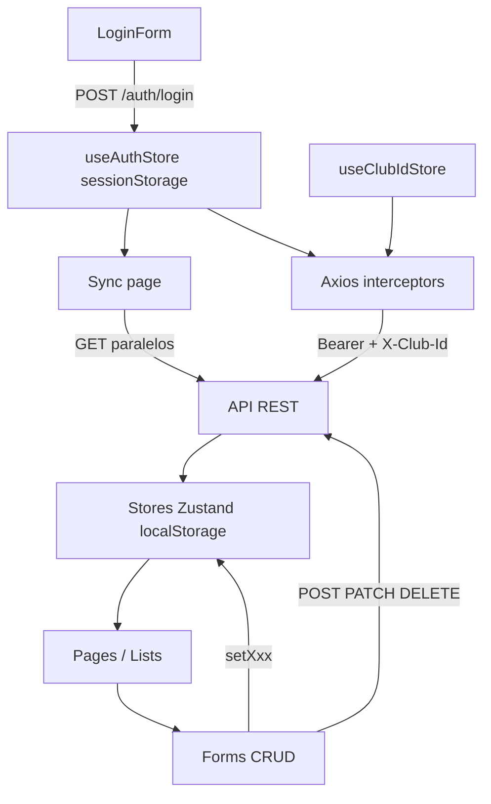
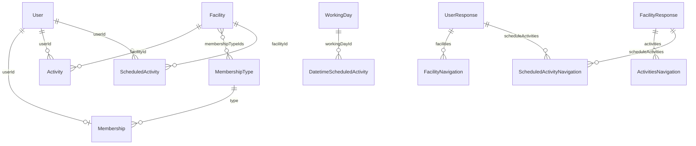

# Arquitectura del Sistema — Frontend (Club UI)

Documento técnico del proyecto **proyecto-club-user-interface**: SPA de gestión de club deportivo (Club Peñarol). Describe **cómo está construida la interfaz**, sus capas, contratos de datos, rutas y comunicación con la API REST.

Para reglas de negocio, validaciones y restricciones funcionales, consultar [`reglas_negocio.md`](reglas_negocio.md).

---

## 1. Introducción

### 1.1 Propósito

Este documento es la referencia técnica para desarrolladores que implementen, revisen o extiendan la UI del club. Cubre stack, estructura de carpetas, entidades TypeScript, estado global, rutas y endpoints consumidos.

### 1.2 Relación con otros documentos

| Documento | Responde a |
|-----------|------------|
| `arquitectura_sistema.md` (este) | Cómo está construida la UI (stack, carpetas, flujos, API consumida) |
| [`reglas_negocio.md`](reglas_negocio.md) | Qué debe hacer el sistema (validaciones, obligatoriedad, restricciones) |

### 1.3 Alcance

- **Incluido:** SPA React en `proyecto-club-user-interface`.
- **Backend externo:** API REST en `VITE_API_URL` (proyecto hermano `proyecto-club-api-rest`, NestJS + Prisma). Este documento lista los endpoints que la UI consume, sin detallar módulos ni esquema de base de datos del servidor.

---

## 2. Stack tecnológico

| Capa | Tecnología | Versión / notas |
|------|------------|-----------------|
| Runtime | Node.js | 24.13.1 (`.nvmrc`) |
| Lenguaje | TypeScript | ~5.9, strict mode, ESM (`"type": "module"`) |
| UI | React + React DOM | 19.2 |
| Build / dev | Vite | 7.3, plugin `@vitejs/plugin-react` |
| Routing | react-router-dom | 7.13, `BrowserRouter` en `src/main.tsx` |
| Estado global | Zustand | 5.0 + middleware `persist` |
| HTTP | Axios | 1.13, cliente en `src/config/axios.ts` |
| Formularios | react-hook-form | 7.71 |
| Validación | Zod + @hookform/resolvers | 4.3 |
| Estilos | Bootstrap 5 + Tailwind CSS 4 | Bootstrap Icons vía CDN |
| Branding | Variables CSS | `src/theme/clubBranding.ts` |
| Gráficos | Chart.js + react-chartjs-2 | Reportes |
| Lint | ESLint 9 | Flat config (`eslint.config.js`) |

### Variables de entorno

| Variable | Uso |
|----------|-----|
| `VITE_API_URL` | URL base del API REST (ej. `https://proyecto-club-api-rest.onrender.com`) |
| `VITE_CLUB_ID` | ID del club enviado en el login |

Definidas en `.env` y tipadas parcialmente en `src/vite-env.d.ts`.

### Lo que el proyecto no utiliza

- Redux, React Query, SWR
- Capa `services/` dedicada (las llamadas HTTP están en pages/components)
- SSR o framework full-stack
- Suite de tests automatizados (Jest, Vitest, Cypress)

---

## 3. Arquitectura general y flujo de datos



### Patrón arquitectónico

1. **Login** — Obtiene JWT y `clubId`; persiste en Zustand (`sessionStorage` / `localStorage`).
2. **Sync** (`src/pages/sync/Sync.tsx`) — Tras login, carga masiva en paralelo de todos los dominios hacia los stores.
3. **CRUD** — Las listas leen del store local; los formularios mutan vía Axios y actualizan el store manualmente.
4. **Wizards multi-paso** — Estado intermedio en stores `useCreate*Store` / `useEdit*Store` hasta armar el DTO final.

### Capas

```
index.html → main.tsx → App.tsx → AppRouter
                                      ↓
              Pages (orquestación) → Components (UI + forms)
                      ↓                      ↓
              Zustand stores  ←→  AxiosInstance → API REST
                      ↓
              Entities.ts (tipos TypeScript)
```

---

## 4. División de carpetas

### Raíz del proyecto

```
proyecto-club-user-interface/
├── index.html              # Shell HTML
├── package.json            # Dependencias y scripts
├── vite.config.ts          # Vite + React + Tailwind
├── tsconfig*.json          # Configuración TypeScript
├── eslint.config.js
├── .env                    # VITE_API_URL, VITE_CLUB_ID
├── reglas_negocio.md       # Reglas funcionales (backend-oriented)
├── arquitectura_sistema.md # Este documento
├── public/                 # Assets estáticos
└── src/                    # Código fuente
```

### `src/`

```
src/
├── main.tsx                # Bootstrap: React root, BrowserRouter, Bootstrap, branding
├── App.tsx                 # Shell mínimo → AppRouter
├── App.css
├── styles.css              # Tailwind + utilidades del club
├── vite-env.d.ts
├── config/
│   └── axios.ts            # Cliente HTTP + interceptores
├── entities/
│   └── Entities.ts         # Contratos TypeScript del dominio
├── store/
│   └── store.ts            # Todos los stores Zustand
├── router/
│   └── AppRouter.tsx       # Rutas + ProtectedRoute inline
├── pages/                  # Contenedores por ruta
├── components/             # UI reutilizable por dominio
├── theme/
│   └── clubBranding.ts     # Variables CSS del club
└── assets/                 # Imágenes estáticas
```

### Subcarpetas por dominio

| Carpeta (`pages/` y `components/`) | Dominio UI |
|------------------------------------|------------|
| `login/` | Autenticación |
| `sync/` | Sincronización inicial post-login |
| `home/` | Dashboard |
| `users/` | Trabajadores, socios, atletas |
| `facilities/` | Instalaciones |
| `activities/` | Reservas puntuales |
| `scheduledActivities/` | Actividades rutinarias |
| `memberships/` | Membresías activas |
| `membershipType/` | Tipos/planes de membresía |
| `reports/` | Reportes (Chart.js) |
| `shared/` | Navbar y componentes transversales |

### Convención Page vs Component

| Capa | Responsabilidad |
|------|-----------------|
| **Page** (`src/pages/`) | Lee stores, define layout de ruta, delega en componentes |
| **Component** (`src/components/`) | Formularios, tablas, UI; recibe entidades tipadas como props cuando es posible |

---

## 5. Entidades e interfaces (`src/entities/Entities.ts`)

Archivo único con ~45 interfaces que reflejan el contrato del backend NestJS.

### 5.1 Convención de nombres

| Sufijo / patrón | Uso | Ejemplo |
|-----------------|-----|---------|
| Sin sufijo / DTO plano | Payload hacia la API (IDs) | `User`, `Facility`, `Activity` |
| `*Request` | DTO explícito de creación/actualización | `ScheduledActivityRequest`, `FacilityWorkerRequest` |
| `*Response` | Respuesta enriquecida del backend | `UserResponse`, `FacilityResponse` |
| `*Navigation` | Proyección embebida dentro de otras respuestas | `UserNavigation`, `FacilityNavigation` |

### 5.2 Catálogo por dominio

#### Club

| Interface | Descripción |
|-----------|-------------|
| `Club` | Datos del club: nombre, dirección, contacto, logo, `isActive` |

#### Usuarios y tipos

| Interface | Descripción |
|-----------|-------------|
| `UserType` | Catálogo de tipos (id, clubId, name) |
| `User` | DTO create/update: datos personales, laborales o deportivos según `typeId` |
| `UserResponse` | Respuesta con `type`, `membership`, `facilities[]`, `scheduleActivities[]` |
| `UserTypeNavigation` | Tipo de usuario embebido |
| `UserNavigation` | Usuario en contexto de actividades |
| `WorkerNavigation` | Trabajador en respuestas de instalaciones |

#### Membresías

| Interface | Descripción |
|-----------|-------------|
| `MembershipType` | Plan del club: nombre, precio |
| `Membership` | DTO: `type`, `userId`, `clubId` |
| `MembershipResponse` | Membresía con `user` y `membershipType` resueltos |
| `UserMembershipNavigation` | Membresía embebida en `UserResponse` |
| `MembershipTypeNavigation` | Tipo de membresía embebido |

#### Instalaciones

| Interface | Descripción |
|-----------|-------------|
| `Facility` | DTO: tipo, capacidad, trabajadores, `membershipTypeIds[]` |
| `FacilityResponse` | Respuesta con trabajadores, actividades, membresías, actividades rutinarias |
| `FacilityNavigation` | Instalación embebida (sin actividades ni membresías) |
| `FacilityWorkerRequest` | Asignación trabajador ↔ instalaciones |
| `FacilityWorkerResponse` | Resultado: `userNavigation` + `facilityNavigation[]` |

#### Actividades puntuales (reservas)

| Interface | Descripción |
|-----------|-------------|
| `Activity` | DTO: nombre, fecha, horario, `userId`, `facilityId`, costo |
| `ActivityResponse` | Con `user` y `facility` resueltos |
| `ActivitiesNavigation` | Actividad embebida en `FacilityResponse` |

#### Actividades rutinarias

| Interface | Descripción |
|-----------|-------------|
| `WorkingDay` / `WorkingDayNavigation` | Día de la semana para programación |
| `DatetimeScheduledActivityRequest` | Horario + `workingDayId` (payload) |
| `DatetimeScheduledActivityNavigation` | Horario con `workingDay` resuelto |
| `ScheduledActivityRequest` | DTO de creación completo |
| `UpdateScheduledActivityRequest` | Actualización parcial |
| `ScheduledActivityQuery` | Query `clubId` + `id` |
| `ScheduledActivityResponse` | Respuesta completa |
| `ScheduledActivityNavigation` | Embebida en `UserResponse` y `FacilityResponse` |

#### Reportes

| Interface | Descripción |
|-----------|-------------|
| `SalaryReportRequest` / `SalaryReportResponse` | Salario de un trabajador |
| `NewUsersReportRequest` / `NewUsersReportResponse` | Usuarios nuevos por tipo y fecha |
| `MonthIncomeReportRequest` / `MonthIncomeReportResponse` | Ingresos mensuales |
| `MonthIncomeProgressionReportRequest` / `MonthIncomeProgressionReportResponse` | Progresión en rango de fechas |

### 5.3 Diagrama de relaciones



### 5.4 Mapa entidad → módulo UI

| Módulo UI | Interfaces principales |
|-----------|------------------------|
| Login | — (respuesta auth no tipada en Entities) |
| Sync | Todas las `*Response` de dominio + `UserType`, `WorkingDay` |
| Trabajadores / Miembros | `User`, `UserResponse`, `Membership`, `MembershipResponse` |
| Instalaciones | `Facility`, `FacilityResponse`, `FacilityWorkerRequest/Response` |
| Reservas | `Activity`, `ActivityResponse` |
| Actividades rutinarias | `ScheduledActivityRequest`, `ScheduledActivityResponse`, `WorkingDay`, `DatetimeScheduledActivity*` |
| Membresías | `Membership`, `MembershipResponse` |
| Tipos membresía | `MembershipType` |
| Reportes | `SalaryReport*`, `NewUsersReport*`, `MonthIncome*` (estado local, sin store) |

**Tipos de wizard** (`CreateScheduledActivityFirstStep`, pasos de create user/facility/activity) viven en `src/store/store.ts`, no en `Entities.ts`.

---

## 6. Estado global (`src/store/store.ts`)

Todos los stores usan Zustand con middleware `persist` y `createJSONStorage`.

### 6.1 Stores de contexto

| Store | Estado | Persistencia |
|-------|--------|--------------|
| `useAuthStore` | `token`, `setToken`, `logout` | `sessionStorage` → `auth-storage` (solo `token`) |
| `useClubIdStore` | `clubId`, `setClubId` | `localStorage` → `club-id-storage` |

### 6.2 Stores de caché de entidades

Patrón común: array + `setAll`, `setOne`, `getById`, `delete`, `update`.

| Store | Tipo | Storage key |
|-------|------|-------------|
| `useMembershipTypeStore` | `MembershipType[]` | `membership-types-storage` |
| `useUserTypeStore` | `UserType[]` | `user-types-storage` |
| `useMembershipStore` | `MembershipResponse[]` | `memberships-storage` |
| `useActivityStore` | `ActivityResponse[]` | `activities-storage` |
| `useFacilityStore` | `FacilityResponse[]` | `facilities-storage` |
| `useUserStore` | `UserResponse[]` | `users-storage` |
| `useScheduledActivityStore` | `ScheduledActivityResponse[]` | `scheduled-activities-storage` |
| `useWorkingDayStore` | `WorkingDay[]` | `working-days-storage` |

**Nota:** `useUserStore` identifica usuarios por clave compuesta `(id, typeId)` en `getUser`, `deleteUser` y `updateUser`. Incluye `assignWorkerFacilities(response)` que coordina con `useFacilityStore`.

### 6.3 Stores de wizard multi-paso

| Store | Pasos / campos | Storage key |
|-------|----------------|-------------|
| `useCreateUserStore` | `firstStep`, `workerSpecificStep`, `athleteSpecificStep` | `create-user-storage` |
| `useEditUserStore` | `firstStep` | `edit-user-storage` |
| `useCreateFacilityStore` | `firstStep` (tipo, capacidad), `secondStep` (trabajadores, membresías) | `create-facility-storage` |
| `useCreateActivityStore` | `firstStep` (datos actividad), `secondStep` (instalación, usuario, costo) | `create-activity-storage` |
| `useEditActivityStore` | `editingActivityId`, `firstStep`, `secondStep`, `resetEditActivity()` | `edit-activity-storage` |
| `useCreateScheduledActivityStore` | `firstStep`, `secondStep`, `thirdStep`, `resetCreateScheduledActivity()` | `create-scheduled-activity-storage` |

### 6.4 Acceso al store en componentes

| Patrón | Uso |
|--------|-----|
| `useXStore((s) => s.items)` | Lectura reactiva para render |
| `useXStore.getState().setXxx()` | Escritura imperativa en submit |
| Cross-store | Ej. `useClubIdStore.getState().clubId` en forms; interceptores Axios |

---

## 7. Rutas del proyecto (`src/router/AppRouter.tsx`)

`ProtectedRoute` es un componente inline: sin `token` → redirect a `/login`. Con token, se muestra `Navbar`.

### 7.1 Auth y sistema

| Ruta | Componente | Protegida |
|------|------------|-----------|
| `/login` | `Login` (redirect a `/sincronizar` si hay token) | No |
| `/` | Redirect → `/home` o `/login` | — |
| `/sincronizar` | `Sync` | Sí |
| `/home` | `Home` | Sí |

### 7.2 Instalaciones

| Ruta | Componente |
|------|------------|
| `/instalaciones` | `FacilitiesList` |
| `/instalaciones/crear/paso-1` | `CreateFacilityFirstStep` |
| `/instalaciones/crear/paso-2` | `CreateFacilitySecondStep` |
| `/instalaciones/editar/:id/paso-1` | `EditFacilityFirstStep` |
| `/instalaciones/editar/:id/paso-2` | `EditFacilitySecondStep` |
| `/instalaciones/eliminar/:id` | `DeleteFacility` |

### 7.3 Trabajadores

| Ruta | Componente |
|------|------------|
| `/trabajadores` | `WorkerList` |
| `/trabajadores/crear/paso-general` | `CreateWorkerFirstStep` |
| `/trabajadores/crear/paso-especifico-trabajador` | `CreateUserWorkerSpecific` |
| `/trabajadores/crear/paso-especifico-atleta` | `CreateUserAthleteSpecific` |
| `/trabajadores/editar/:id/paso-1` | `EditWorkerFirstStep` |
| `/trabajadores/editar/:id/paso-especifico-trabajador` | `EditUserWorkerSpecific` |
| `/trabajadores/editar/:id/paso-especifico-atleta` | `EditUserAthleteSpecific` |
| `/trabajadores/eliminar/:id` | `DeleteUser` |
| `/trabajadores/:id/instalaciones` | `AssignWorkerFacilities` |

### 7.4 Miembros

| Ruta | Componente |
|------|------------|
| `/miembros` | `MemberList` |
| `/miembros/crear/paso-general` | `CreateMemberFirstStep` |
| `/miembros/crear/paso-especifico-atleta` | `CreateUserAthleteSpecific` |
| `/miembros/editar/:id/:typeId/paso-1` | `EditMemberFirstStep` |
| `/miembros/editar/:id/paso-especifico-atleta` | `EditUserAthleteSpecific` |
| `/miembros/eliminar/:id/:typeId` | `DeleteUser` |

### 7.5 Reservas

| Ruta | Componente |
|------|------------|
| `/reservas` | `Activities` |
| `/reservas/crear/paso-1` | `CreateActivity` |
| `/reservas/crear/paso-2` | `CreateActivitySecondStep` |
| `/reservas/editar/:id` | `EditActivityFirstStep` |
| `/reservas/editar/:id/paso-2` | `EditActivitySecondStep` |
| `/reservas/eliminar/:id` | `DeleteActivity` |

### 7.6 Actividades rutinarias

| Ruta | Componente |
|------|------------|
| `/actividades-rutinarias` | `ScheduledActivities` |
| `/actividades-rutinarias/crear/paso-1` | `CreateScheduledActivityFirstStep` |
| `/actividades-rutinarias/crear/paso-2` | `CreateScheduledActivitySecondStepForm` |
| `/actividades-rutinarias/crear/paso-3` | `CreateScheduledActivityThirdStep` |
| `/actividades-rutinarias/editar/:id` | `EditScheduledActivity` |
| `/actividades-rutinarias/eliminar/:id` | `DeleteScheduledActivities` |

### 7.7 Membresías y tipos

| Ruta | Componente |
|------|------------|
| `/membresias` | `MembershipList` |
| `/membresias/crear` | `CreateMembership` |
| `/membresias/editar/:id` | `EditMembership` |
| `/membresias/eliminar/:id` | `DeleteMembership` |
| `/tipos-membresia` | `MembershipTypes` |
| `/tipos-membresia/crear` | `CreateMembershipType` |
| `/tipos-membresia/editar/:id` | `EditMembershipType` |
| `/tipos-membresia/eliminar/:id` | `DeleteMembershipType` |

### 7.8 Reportes

| Ruta | Componente |
|------|------------|
| `/reportes` | `Reports` |
| `/reportes/salario/paso-1` | `ReportSalaryStep` |
| `/reportes/salario/:id` | `SalaryReportPage` |
| `/reportes/nuevos-usuarios` | `NewUsersReportPage` |

**Total:** 46 entradas de ruta (44 páginas + `/login` + redirect `/`).

### 7.9 Mapa ruta UI ↔ ruta API

| Ruta UI | Recurso API |
|---------|-------------|
| `/reservas` | `/activities` |
| `/actividades-rutinarias` | `/scheduled-activities` |
| `/instalaciones` | `/facilities` |
| `/trabajadores`, `/miembros` | `/users` |
| `/membresias` | `/membership` |
| `/tipos-membresia` | `/membership-type` |
| `/reportes` | `/reports/*` |

---

## 8. Endpoints consumidos

Base URL: `import.meta.env.VITE_API_URL`. Cliente: `src/config/axios.ts` (exportado como default; importado como `AxiosInstance`, `Axios` o `api`).

Headers automáticos en cada request:
- `Authorization: Bearer {token}` (si hay token)
- `X-Club-Id: {clubId}` (si `clubId > 0`)

### 8.1 Autenticación

| Método | Endpoint | Archivo |
|--------|----------|---------|
| POST | `/auth/login` | `src/components/login/LoginForm.tsx` |

Body: `{ email, password, clubId: VITE_CLUB_ID }`. Respuesta: `{ accessToken, clubId? }`.

### 8.2 Sincronización inicial (`Sync.tsx`)

Todos con query `?clubId={clubId}`:

| Método | Endpoint |
|--------|----------|
| GET | `/membership-type?clubId=` |
| GET | `/membership?clubId=` |
| GET | `/activities?clubId=` |
| GET | `/user-type?clubId=` |
| GET | `/facilities?clubId=` |
| GET | `/users?clubId=` |
| GET | `/scheduled-activities?clubId=` |
| GET | `/scheduled-activities/working-days?clubId=` |

### 8.3 Tipos de membresía

| Método | Endpoint | Archivo(s) |
|--------|----------|------------|
| GET | `/membership-type/{id}` | `EditMembershipType.tsx`, `DeleteMembershipType.tsx` |
| POST | `/membership-type` | `CreateMembershipTypeForm.tsx` |
| PATCH | `/membership-type/{id}?clubId=` | `EditMembershipTypeForm.tsx` |
| DELETE | `/membership-type/{id}?clubId=` | `DeleteMembershipTypeForm.tsx` |

### 8.4 Membresías

| Método | Endpoint | Archivo(s) |
|--------|----------|------------|
| POST | `/membership` | `CreateMembershipForm.tsx`, `CreateUserAthleteForm.tsx`, `CreateMemberFirstStepForm.tsx` |
| PATCH | `/membership/{id}?clubId=` | `EditMembershipForm.tsx`, `EditMemberFirstStepForm.tsx`, `EditUserAthleteForm.tsx` |
| DELETE | `/membership/{id}?clubId=` | `DeleteMembershipForm.tsx` |

### 8.5 Reservas (activities)

| Método | Endpoint | Archivo(s) |
|--------|----------|------------|
| POST | `/activities` | `CreateActivityForm.tsx`, `CreateActivitySecondStepForm.tsx`, `ActivityFormModal.tsx` |
| PATCH | `/activities/{id}?clubId=` | `ActivityFormModal.tsx`, `EditActivityFormSecondStep.tsx` |
| DELETE | `/activities/{id}?clubId=` | `DeleteActivityForm.tsx` |

### 8.6 Actividades rutinarias

| Método | Endpoint | Archivo(s) |
|--------|----------|------------|
| POST | `/scheduled-activities` | `CreateScheduledActivityFormThirdStep.tsx` |
| PATCH | `/scheduled-activities/{id}?clubId=` | `EditScheduledActivityForm.tsx` |
| DELETE | `/scheduled-activities/{id}?clubId=` | `DeleteScheduledActivitiesForm.tsx` |

### 8.7 Instalaciones

| Método | Endpoint | Archivo(s) |
|--------|----------|------------|
| GET | `/facilities?clubId=` | `AssignWorkerFacilitiesForm.tsx` |
| POST | `/facilities` | `CreateFacilityFormSecondStep.tsx` |
| PATCH | `/facilities/{id}?clubId=` | `EditFacilityFormSecondStep.tsx` |
| DELETE | `/facilities/{id}?clubId=` | `DeleteFacilityForm.tsx` |

### 8.8 Usuarios

| Método | Endpoint | Archivo(s) |
|--------|----------|------------|
| POST | `/users` | `CreateUserWorkerForm.tsx`, `CreateUserAthleteForm.tsx`, `CreateMemberFirstStepForm.tsx` |
| PATCH | `/users/{id}` | `EditUserWorkerForm.tsx`, `EditMemberFirstStepForm.tsx`, `EditUserAthleteForm.tsx` |
| DELETE | `/users/{id}?clubId=&typeId=` | `DeleteUserForm.tsx` |
| DELETE | `/users/{id}` (body rollback) | `CreateUserAthleteForm.tsx` |

### 8.9 Asignación trabajador-instalaciones

| Método | Endpoint | Archivo |
|--------|----------|---------|
| POST | `/facility-workers` | `AssignWorkerFacilitiesForm.tsx` |

### 8.10 Reportes

| Método | Endpoint | Query params | Archivo |
|--------|----------|--------------|---------|
| GET | `/reports/salaries` | `userId` | `SalaryReportCard.tsx` |
| GET | `/reports/newUsers` | `clubId`, `typeId`, `date` | `NewUsersReportTable.tsx` |
| GET | `/reports/monthIncome` | `clubId`, `date` | `MonthIncomeReportTable.tsx` |
| GET | `/reports/monthlyProgressionIncome` | `clubId`, `dateStart`, `dateEnd` | `MonthIncomeProgressionTable.tsx` |

Los reportes usan estado local (`useState`); no persisten en Zustand.

### 8.11 Cliente HTTP — comportamiento

```typescript
// src/config/axios.ts (resumen)
axios.create({ baseURL: VITE_API_URL, headers: { 'Content-Type': 'application/json' } })
// Request: Bearer token + X-Club-Id
// Response error 4xx/5xx: alert('error en servidor') — sin refresh token ni logout automático en 401
```

---

## 9. Autenticación y multi-tenancy

```mermaid
flowchart TD
    A[Usuario en /login] --> B[POST /auth/login]
    B -->|201| C[setToken en sessionStorage]
    C --> D[setClubId en localStorage]
    D --> E[/sincronizar]
    E --> F[GET masivos → stores]
    F --> G[Rutas protegidas]
    G --> H[Axios: Bearer + X-Club-Id]
    I[Navbar logout] --> J[token = null]
    J --> K[/login]
```

### Flujo detallado

1. Usuario ingresa email y contraseña en `LoginForm`.
2. POST `/auth/login` con `{ email, password, clubId: VITE_CLUB_ID }`.
3. Si status `201`: guarda `accessToken` en `useAuthStore` (sessionStorage) y opcionalmente `clubId` en `useClubIdStore` (localStorage).
4. Navega a `/sincronizar` para hidratar stores.
5. Todas las requests incluyen `Authorization` y `X-Club-Id`.
6. Logout desde `Navbar`: `logout()` → `token = null` → `/login`. No hay invalidación en el backend.

### Multi-tenancy

El club activo se determina por:
- `VITE_CLUB_ID` en login
- `clubId` persistido en `useClubIdStore`
- Header `X-Club-Id` en cada request
- Query param `clubId` en la mayoría de endpoints

---

## 10. Patrones de implementación

### Checklist para un nuevo feature

1. **Tipos** — Agregar interfaces Request/Response en `src/entities/Entities.ts` si el backend expone un contrato nuevo.
2. **Store** — Si la entidad se lista o cachea localmente, agregar store en `src/store/store.ts` con patrón CRUD + `persist`.
3. **Page** — Crear contenedor en `src/pages/{dominio}/`.
4. **Component** — Formulario/lista en `src/components/{dominio}/`.
5. **Ruta** — Registrar en `src/router/AppRouter.tsx` dentro de `ProtectedRoute`.
6. **Validación** — Schema Zod local en el form; mapear a DTO de `Entities.ts` en `onSubmit`.
7. **Mutación** — `AxiosInstance.post/patch/delete` → actualizar store con `setXxx()` → `navigate()`.
8. **Sync** — Si la entidad debe cargarse al inicio, agregar GET en `Sync.tsx`.

### Formularios multi-paso

1. Cada paso escribe en `useCreateXxxStore` / `useEditXxxStore`.
2. El paso final lee todos los pasos con `getState()`.
3. Ensambla el DTO (`ScheduledActivityRequest`, `Facility`, etc.).
4. Envía a la API y actualiza el store de entidad.

### Validación desacoplada

React Hook Form + Zod definen el schema del formulario (puede diferir del DTO). En submit se transforma al tipo de `Entities.ts`.

---

## 11. Glosario técnico

| Término | Significado en este proyecto |
|---------|------------------------------|
| **SPA** | Single Page Application; todo el routing es client-side con React Router |
| **Sync** | Pantalla `/sincronizar` que carga datos del API al store local tras el login |
| **Wizard multi-paso** | Formulario dividido en rutas/pasos con estado intermedio en Zustand |
| **Navigation** | Proyección ligera de una entidad embebida en otra respuesta (evita ciclos y reduce payload) |
| **Response** | Objeto enriquecido devuelto por el API con relaciones resueltas |
| **Request / DTO** | Payload plano con IDs para crear o actualizar |
| **Offline-first parcial** | Stores persistidos en localStorage actúan como caché; la fuente de verdad sigue siendo la API |
| **ProtectedRoute** | Guard inline en AppRouter que exige token JWT |
| **typeId** | Discriminador de tipo de usuario: 1=Trabajador, 2=Socio, 3=Atleta |

---

## 12. Scripts de desarrollo

```bash
npm run dev      # Servidor de desarrollo Vite
npm run build    # tsc -b && vite build
npm run lint     # ESLint
npm run preview  # Preview del build de producción
```

---

*Última revisión: alineado con el estado del repositorio `proyecto-club-user-interface`.*
