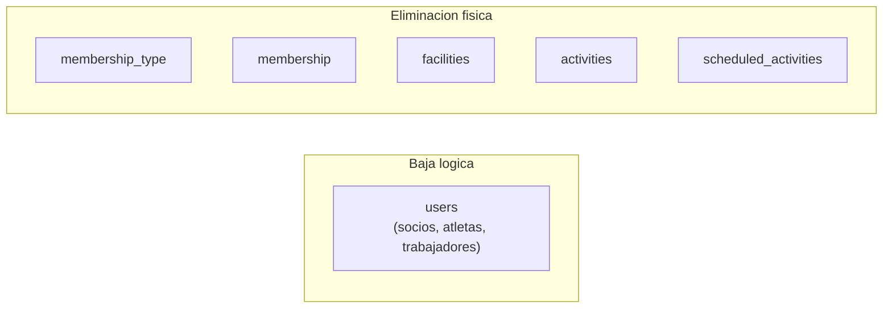
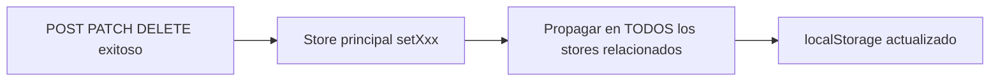
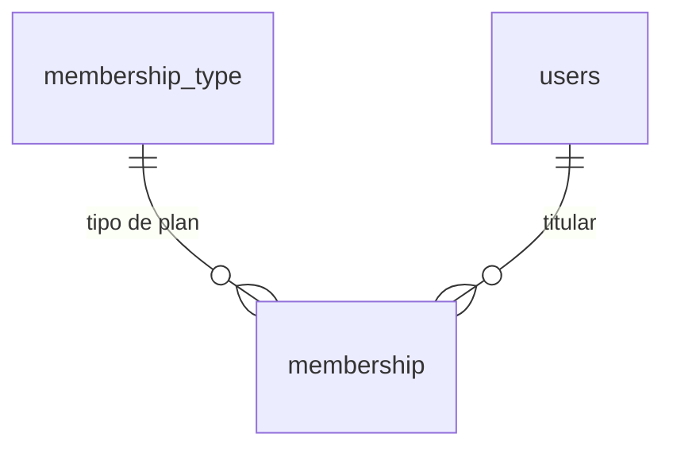
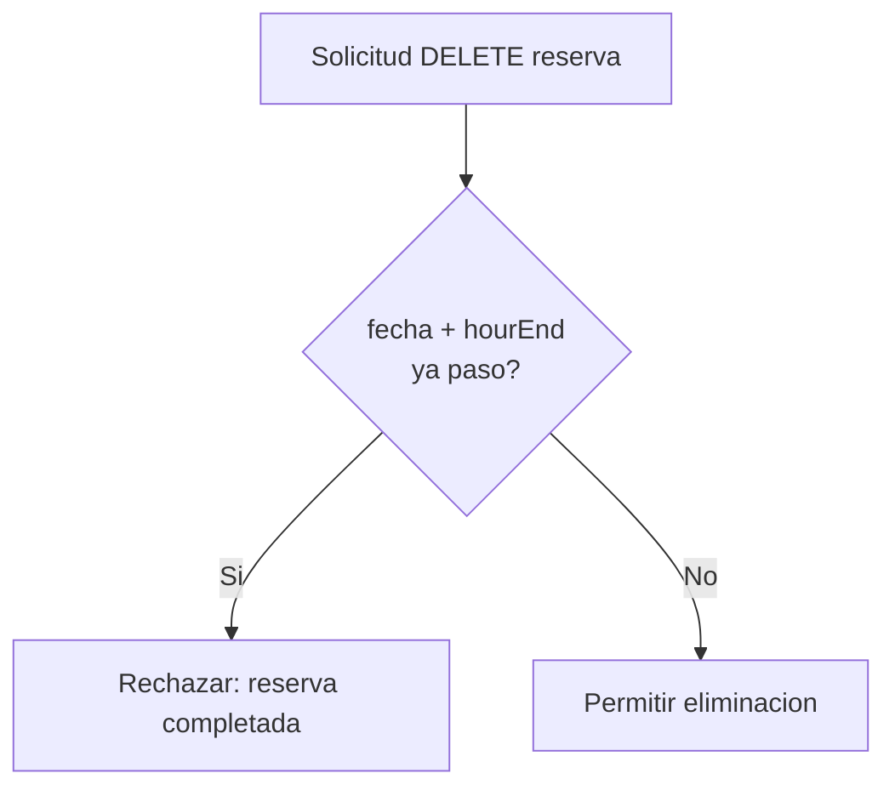

# Reglas de Negocio — Club UI

Documento de referencia funcional del proyecto **proyecto-club-user-interface**. Define **qué debe cumplir el sistema** en cada dominio de negocio: campos obligatorios, restricciones de unicidad, reglas de eliminación, validaciones críticas y **comportamiento esperado de la UI** sobre el store local.

Para detalles técnicos de implementación (stack React, stores Zustand, rutas UI, endpoints consumidos, `Entities.ts`), consultar [`arquitectura_sistema.md`](arquitectura_sistema.md).

---

## 1. Introducción

### 1.1 Propósito

Este documento es la **fuente de verdad de negocio** para desarrolladores que implementen, revisen o validen features en la interfaz. Cuando haya diferencia entre el código actual y estas reglas, **las reglas de este documento representan el comportamiento objetivo** del sistema.

Las validaciones de negocio las **aplica el backend** (API REST en `VITE_API_URL`, proyecto `proyecto-club-api-rest`). La UI debe **reflejarlas en formularios Zod** y **mantener el store local coherente** tras cada mutación exitosa.

### 1.2 Relación con la arquitectura

| Documento | Responde a |
|-----------|------------|
| [`arquitectura_sistema.md`](arquitectura_sistema.md) | Cómo está construida la UI (stack, stores, rutas, endpoints, tipos) |
| `reglas_negocio.md` (este) | Qué debe hacer el sistema (validaciones, restricciones, propagación local) |

### 1.3 Alcance

Se documentan los siete dominios principales del negocio:

| Dominio | Ruta API | Ruta UI | Store |
|---------|----------|---------|-------|
| Tipos de membresía | `/membership-type` | `/tipos-membresia` | `useMembershipTypeStore` |
| Usuarios (trabajadores, socios, atletas) | `/users` | `/trabajadores`, `/miembros` | `useUserStore` |
| Membresías | `/membership` | `/membresias` | `useMembershipStore` |
| Instalaciones | `/facilities` | `/instalaciones` | `useFacilityStore` |
| Reservas puntuales | `/activities` | `/reservas` | `useActivityStore` |
| Actividades rutinarias | `/scheduled-activities` | `/actividades-rutinarias` | `useScheduledActivityStore` |

Módulos auxiliares (`auth`, `reports`, `user_type`) quedan fuera del alcance de reglas de dominio, salvo la referencia al catálogo de tipos de usuario en la sección 3.

---

## 2. Principios transversales

Reglas que aplican a **todos** los módulos del alcance.

### 2.1 Multi-tenancy por club

- Cada club opera de forma **aislada**: solo puede crear, editar y eliminar **sus propios** registros.
- El campo `clubId` identifica el club propietario del dato.
- En la UI, el club activo se determina por:
  - `VITE_CLUB_ID` enviado en el login ([`src/components/login/LoginForm.tsx`](src/components/login/LoginForm.tsx))
  - `useClubIdStore` persistido en `localStorage`
  - Header `X-Club-Id` en cada request ([`src/config/axios.ts`](src/config/axios.ts))

### 2.2 Identificadores autogenerados

- El `id` de cada entidad se **genera en el backend** al crear un registro.
- La UI **no envía `id` al crear**; lo recibe en la respuesta del POST y lo persiste con `setXxx()` en el store correspondiente.

### 2.3 Operaciones CRUD

| Operación | Descripción (backend) | Responsabilidad UI |
|-----------|----------------------|-------------------|
| **Crear** | Alta con validaciones de negocio | POST → `setXxx()` + propagación local (ver §2.6) |
| **Editar** | Modificación de registro existente | PATCH → `updateXxx()` + propagación local |
| **Eliminar** | Baja según estrategia por entidad (ver §2.4) | DELETE → actualizar store + propagación local |
| **Consultar** | Listado filtrado por `clubId` | Lectura desde store (hidratado en `/sincronizar`) |

### 2.4 Estrategias de eliminación

No todas las entidades se eliminan de la misma forma:



| Entidad | Estrategia | Comportamiento |
|---------|------------|----------------|
| `users` (socio, atleta, trabajador) | **Baja lógica** | No se borra el registro; se marca `isActive = false` |
| `membership_type` | Eliminación física | Se elimina el registro |
| `membership` | Eliminación física | Se elimina el registro |
| `facilities` | Eliminación física | Se elimina el registro |
| `activities` (reservas) | Eliminación física | Solo si la reserva **no está completada** (ver sección 9) |
| `scheduled_activities` | Eliminación física | Se elimina el registro |

### 2.5 Estados activo / inactivo

Entidades con campo `isActive`:

| Valor | Significado |
|-------|-------------|
| `isActive: true` | Activo / activa |
| `isActive: false` | Inactivo / inactiva |

Aplica a: `users`, `facilities`, `activities` (reservas).

### 2.6 Consistencia de navegaciones embebidas en el store local

#### Regla universal (aplica a TODAS las entidades)

> **Toda entidad del sistema** — tipos de membresía, usuarios (trabajador/socio/atleta), membresías, instalaciones, reservas y actividades rutinarias — debe cumplir el mismo patrón de propagación local tras un CRUD exitoso. No es una regla exclusiva de trabajadores ni de instalaciones; es **transversal y obligatoria para cada dominio**.

Los ejemplos trabajador ↔ instalación que se detallan más abajo **ilustran el patrón**; la misma lógica se repite para cada fila de la matriz de propagación.

#### Principio general

Tras **cada mutación CRUD exitosa** (respuesta OK del API), la UI debe actualizar **todos los stores Zustand** donde la entidad aparezca embebida como `*Navigation` u objeto anidado en un `*Response`. **No se realizan llamadas adicionales al API** para refrescar esas relaciones; la propagación es **solo local** (`localStorage` vía persist).



#### Reglas por operación (aplican a cada entidad)

| Operación | Comportamiento local |
|-----------|---------------------|
| **Crear** | Agregar al store principal **y** insertar en **cada** lista/campo de navegación donde la entidad deba aparecer según sus relaciones |
| **Editar** | Actualizar en el store principal **y** reemplazar la proyección embebida en **todas** las navegaciones que referencien el mismo `id` |
| **Soft delete** (solo `users`: `isActive = false`) | Actualizar el registro principal **y eliminarlo** de las listas embebidas donde un inactivo no debe mostrarse |
| **Hard delete** (resto de entidades) | Eliminar del store principal **y** quitar de **todas** las listas embebidas que la referencien |

#### Matriz de propagación por entidad

Basada en [`src/entities/Entities.ts`](src/entities/Entities.ts). Para **cada fila**, las operaciones CRUD aplicables deben propagarse a **todos** los campos listados:

| Entidad | Store principal | Navegaciones embebidas a sincronizar |
|---------|-----------------|--------------------------------------|
| **MembershipType** | `useMembershipTypeStore` | `FacilityResponse.membershipTypes[]`; `ScheduledActivityResponse.membershipTypes[]`; `MembershipResponse.membershipType`; `UserResponse.membership.membershipType` |
| **User** (trabajador) | `useUserStore` | `FacilityResponse.responsibleWorker`, `assistantWorkers[]`; `ScheduledActivityResponse.user`, `assistantWorkers[]`; `ActivityResponse.user`; `UserResponse.facilities[]` |
| **User** (socio/atleta) | `useUserStore` | `MembershipResponse.user`; `UserResponse.membership` |
| **Membership** | `useMembershipStore` | `UserResponse.membership` (en el usuario asociado) |
| **Facility** | `useFacilityStore` | `UserResponse.facilities[]`; `ActivityResponse.facility`; `ScheduledActivityResponse.facility` |
| **Activity** | `useActivityStore` | `FacilityResponse.activities[]` |
| **ScheduledActivity** | `useScheduledActivityStore` | `FacilityResponse.scheduleActivities[]`; `UserResponse.scheduleActivities[]` |

#### Tabla CRUD × entidad

| Entidad | Crear | Editar | Soft delete | Hard delete |
|---------|-------|--------|-------------|-------------|
| **MembershipType** | `setMembershipType` + agregar en `membershipTypes[]` de facilities y scheduled activities que lo incluyan | `updateMembershipType` + reemplazar en todas las navegaciones embebidas | — | `deleteMembershipType` + quitar de `membershipTypes[]` en facilities, scheduled, memberships y users |
| **User** (trabajador) | `setUser` + agregar en facilities/activities/scheduled según asignación | `updateUser` + reemplazar en todas las navegaciones | `updateUser(isActive:false)` + **quitar** de listas embebidas | — (usuarios no tienen hard delete) |
| **User** (socio/atleta) | `setUser` + vincular `membership` si aplica | `updateUser` + actualizar en `MembershipResponse.user` | Igual trabajador: quitar de listas embebidas donde corresponda | — |
| **Membership** | `setMembership` + actualizar `UserResponse.membership` del usuario | `updateMembership` + propagar a user embebido | — | `deleteMembership` + limpiar `UserResponse.membership` |
| **Facility** | `setFacility` + agregar en `UserResponse.facilities[]` de trabajadores asignados | `updateFacility` + reemplazar en users, activities y scheduled | — | `deleteFacility` + quitar de users, activities, scheduled |
| **Activity** | `setActivity` + agregar en `FacilityResponse.activities[]` | `updateActivity` + reemplazar en facility y user embebidos | — | `deleteActivity` + quitar de `FacilityResponse.activities[]` |
| **ScheduledActivity** | `setScheduledActivity` + agregar en facility y users relacionados | `updateScheduledActivity` + reemplazar en todas las navegaciones | — | `deleteScheduledActivity` + quitar de facility y users |

#### Ejemplos concretos (ilustración del patrón universal)

*Los siguientes casos usan relaciones concretas porque son las más visibles en la UI; el mismo razonamiento aplica a **todas** las entidades según la matriz anterior.*

**Trabajador ↔ instalación (ilustración):**

1. **Soft delete:** `updateUser(isActive:false)` → recorrer `useFacilityStore` y **quitar** al trabajador de `responsibleWorker` / `assistantWorkers` en cada instalación donde aparezca.
2. **Editar:** `updateUser` → reemplazar la proyección en `responsibleWorker` / `assistantWorkers` de cada `FacilityResponse` afectada.
3. **Crear + asignar:** `setUser` + propagar a `UserResponse.facilities[]` y `FacilityResponse.assistantWorkers[]` (patrón parcial en `assignWorkerFacilities` de [`src/store/store.ts`](src/store/store.ts)).

**Otros dominios (misma lógica, distintas navegaciones):**

4. **Editar tipo de membresía:** `updateMembershipType` → reemplazar en `membershipTypes[]` de cada `FacilityResponse` y `ScheduledActivityResponse` que lo incluya, y en `MembershipResponse` / `UserResponse.membership`.
5. **Hard delete instalación:** `deleteFacility` → quitar de `UserResponse.facilities[]`, de `ActivityResponse.facility` y de `ScheduledActivityResponse.facility`.
6. **Crear reserva:** `setActivity` → agregar en `FacilityResponse.activities[]` de la instalación correspondiente.
7. **Hard delete actividad rutinaria:** `deleteScheduledActivity` → quitar de `FacilityResponse.scheduleActivities[]` y `UserResponse.scheduleActivities[]`.

#### Implementación de referencia

- Stores: [`src/store/store.ts`](src/store/store.ts)
- Tipos embebidos: [`src/entities/Entities.ts`](src/entities/Entities.ts) — sufijos `*Navigation`
- Patrón existente parcial: `assignWorkerFacilities` (solo create/edit user ↔ facility)
- Objetivo futuro: helpers centralizados por entidad (ej. `propagateUserChanges`, `propagateFacilityChanges`) — **pendiente de implementación universal**

---

## 3. Catálogo de tipos de usuario

Los usuarios del sistema se discriminan por `typeId`, referencia al catálogo `user_type` (store `useUserTypeStore`, cargado en Sync).

| typeId | Nombre | Descripción |
|--------|--------|-------------|
| 1 | Trabajador | Personal del club (entrenadores, administrativos, etc.) |
| 2 | Socio | Miembro estándar del club |
| 3 | Atleta | Miembro con datos deportivos y médicos extendidos |

**UI:** `/trabajadores` (typeId 1), `/miembros` (typeId 2 y 3). **Tipos:** `UserType`, `User`, `UserResponse` en `Entities.ts`.

---

## 4. Tipos de membresía (`membership_type`)

### 4.1 Descripción funcional

Un **tipo de membresía** es un plan comercial del club (por ejemplo: Básico, Premium, VIP). Define **nombre** y **precio**.

Se referencia en membresías activas, instalaciones (`membershipTypes[]`) y actividades rutinarias (`membershipTypes[]`).

### 4.2 Campos

| Campo | Tipo | Obligatorio | Descripción |
|-------|------|-------------|-------------|
| `id` | `number` | Autogenerado | Identificador único dentro del club |
| `clubId` | `number` | Sí | Club propietario |
| `name` | `string` | Sí | Nombre del plan |
| `price` | `number` | Sí | Precio ≥ 0 |

### 4.3 Reglas de validación

- `name` y `price` obligatorios en creación y edición.
- `price` ≥ 0.
- No se permiten tipos de membresía de otro club.

### 4.4 Operaciones

| Operación | Regla |
|-----------|-------|
| Crear | Alta con `name` y `price` obligatorios |
| Editar | Modificación de `name` y/o `price` |
| Eliminar | Eliminación física |
| Consultar | Solo tipos del club actual |

### 4.5 Propagación local

Ver **§2.6** — fila **MembershipType**. Tras create/edit/hard delete, sincronizar `membershipTypes[]` en facilities y scheduled activities, y `membershipType` embebido en memberships y users.

**UI:** `/tipos-membresia` — **API:** `/membership-type` — **Store:** `useMembershipTypeStore` — **Componentes:** [`src/components/membershipType/`](src/components/membershipType/)

---

## 5. Usuarios — Socios y Atletas (`users`, typeId 2 y 3)

### 5.1 Descripción funcional

Los **socios** (typeId = 2) y **atletas** (typeId = 3) son miembros del club. El atleta extiende al socio con información deportiva y médica obligatoria.

### 5.2 Campos comunes

| Campo | Tipo | Obligatorio | Restricción |
|-------|------|-------------|------------|
| `id` | `number` | Autogenerado | Identificador único (club + tipo) |
| `clubId` | `number` | Sí | Club propietario |
| `name` | `string` | Sí | Nombre completo |
| `email` | `string` | Sí | Único por club |
| `typeId` | `number` | Sí | `2` = socio, `3` = atleta |
| `document` | `string` | Sí | Único por club |
| `createdAt` | `Date` | Sí | Fecha de alta |
| `isActive` | `boolean` | Sí | Estado activo/inactivo |

La membresía activa se gestiona en `/membresias` (`Membership`, `MembershipResponse`).

### 5.3 Reglas de validación

- `document` y `email` únicos por club.
- Al crear socio/atleta, típicamente se crea también una membresía asociada.

### 5.4 Regla de eliminación (baja lógica)

**Eliminar un socio o atleta NO borra el registro.** Se marca `isActive = false` y se conserva el historial.

En la UI: `DeleteUserForm` → DELETE `/users/{id}?clubId=&typeId=` → `updateUser` con la respuesta del API.

### 5.5 Extensión Atleta (typeId = 3)

Campos adicionales obligatorios al crear o editar un atleta:

| Campo | Tipo | Descripción |
|-------|------|-------------|
| `gender` | `string` | Género |
| `weight` | `number` | Peso (kg) |
| `height` | `number` | Altura |
| `birthDate` | `Date` | Fecha de nacimiento (no futura) |
| `diet` | `string` | Dieta |
| `trainingPlan` | `string` | Plan de entrenamiento |
| `allergies` | `string` | Alergias |
| `medications` | `string` | Medicamentos |
| `medicalConditions` | `string` | Condiciones médicas |

### 5.6 Operaciones

| Operación | Regla |
|-----------|-------|
| Crear socio | Campos comunes + membresía |
| Crear atleta | Campos comunes + extensión atleta + membresía |
| Editar | Validar unicidad de `document`/`email` si cambian |
| Eliminar | Baja lógica (`isActive = false`) |

### 5.7 Propagación local

Ver **§2.6** — fila **User (socio/atleta)**. Tras create/edit/soft delete, sincronizar `MembershipResponse.user` y `UserResponse.membership`.

**UI:** `/miembros` — **API:** `/users` — **Store:** `useUserStore` — **Componentes:** `CreateMemberFirstStepForm`, `EditMemberFirstStepForm`, `CreateUserAthleteForm`, `DeleteUserForm`

---

## 6. Usuarios — Trabajadores (`users`, typeId = 1)

### 6.1 Descripción funcional

Los **trabajadores** son el personal del club. Pueden ser responsables o asistentes en instalaciones, reservas y actividades rutinarias.

### 6.2 Campos

| Campo | Tipo | Obligatorio | Descripción |
|-------|------|-------------|-------------|
| `id` | `number` | Autogenerado | |
| `clubId` | `number` | Sí | |
| `name` | `string` | Sí | |
| `email` | `string` | Sí | Único por club |
| `typeId` | `number` | Sí | Siempre `1` |
| `document` | `string` | Sí | Único por club |
| `salary` | `number` | Sí | ≥ 0 |
| `hoursToWorkPerDay` | `number` | Sí | ≥ 0 |
| `employmentStartDate` | `Date` | Sí | |
| `startWorkAt` | `string` | Sí | `HH:mm`, anterior a `endWorkAt` |
| `endWorkAt` | `string` | Sí | `HH:mm` |
| `isActive` | `boolean` | Sí | |

### 6.3 Reglas de validación

- `document` y `email` únicos por club.
- `startWorkAt` < `endWorkAt`.
- `salary` ≥ 0, `hoursToWorkPerDay` ≥ 0.

### 6.4 Regla de eliminación (baja lógica)

Igual que socios/atletas: `isActive = false`, sin borrado físico.

### 6.5 Operaciones

| Operación | Regla |
|-----------|-------|
| Crear | Todos los campos obligatorios |
| Editar | Validar horarios y unicidad |
| Eliminar | Baja lógica |
| Asignar instalaciones | POST `/facility-workers` |

### 6.6 Propagación local

Ver **§2.6** — fila **User (trabajador)**. Tras create/edit/soft delete, sincronizar en facilities (`responsibleWorker`, `assistantWorkers[]`), scheduled activities (`user`, `assistantWorkers[]`), activities (`user`) y `UserResponse.facilities[]`.

**UI:** `/trabajadores`, `/trabajadores/:id/instalaciones` — **API:** `/users`, `/facility-workers` — **Store:** `useUserStore`, `useFacilityStore` — **Componentes:** `CreateUserWorkerForm`, `EditUserWorkerForm`, `AssignWorkerFacilitiesForm`, `DeleteUserForm`

---

## 7. Membresías (`membership`)

### 7.1 Descripción funcional

Una **membresía** es la suscripción de un socio o atleta a un tipo de membresía, con fecha de creación y vencimiento.

### 7.2 Campos

| Campo | Tipo | Obligatorio | Descripción |
|-------|------|-------------|-------------|
| `id` | `number` | Autogenerado | |
| `clubId` | `number` | Sí | |
| `type` / `membershipTypeId` | `number` | Sí | FK a tipo de membresía |
| `userId` | `number` | Sí | Socio o atleta titular |
| `expiration` | `Date` | Sí | Calculada (ver 7.3) |
| `createdAt` | `Date` | Sí | |

### 7.3 Regla de cálculo de vencimiento

```
expiration = createdAt + 30 días
```

El backend calcula la expiración; la UI no la envía al crear.

### 7.4 Reglas de validación

- `membershipTypeId` debe existir en el mismo club.
- `userId` debe referenciar un socio o atleta del club.

### 7.5 Diagrama de relaciones



### 7.6 Operaciones

| Operación | Regla |
|-----------|-------|
| Crear | `expiration = createdAt + 30 días` (backend) |
| Editar | Modificar tipo o datos según reglas |
| Eliminar | Eliminación física |

### 7.7 Propagación local

Ver **§2.6** — fila **Membership**. Tras create/edit/hard delete, actualizar `UserResponse.membership` del usuario titular.

**UI:** `/membresias` — **API:** `/membership` — **Store:** `useMembershipStore`, `useUserStore` — **Componentes:** [`src/components/memberships/`](src/components/memberships/)

---

## 8. Instalaciones (`facilities`)

### 8.1 Descripción funcional

Una **instalación** es un espacio físico reservable. Define trabajadores, tipos de membresía habilitados, reservas y actividades rutinarias asociadas.

### 8.2 Campos

| Campo | Tipo | Obligatorio | Descripción |
|-------|------|-------------|-------------|
| `id` | `number` | Autogenerado | |
| `clubId` | `number` | Sí | |
| `type` | `string` | Sí | Nombre/tipo de instalación |
| `capacity` | `number` | Sí | ≥ 4 |
| `responsibleWorker` | `number` | No | ID trabajador responsable |
| `assistantWorkers` | `number[]` | No | IDs asistentes |
| `membershipTypeIds` | `number[]` | Sí | Tipos de membresía habilitados |
| `isActive` | `boolean` | Sí | |

### 8.3 Reglas de validación

- `membershipTypeIds` con al menos un tipo válido del club.
- Trabajadores referenciados deben ser `typeId = 1` y activos.
- `capacity` ≥ 4.

### 8.4 Operaciones

| Operación | Regla |
|-----------|-------|
| Crear | Wizard 2 pasos; validar membresías y trabajadores |
| Editar | Actualizar relaciones |
| Eliminar | Eliminación física |

### 8.5 Propagación local

Ver **§2.6** — fila **Facility**. Tras create/edit/hard delete, sincronizar `UserResponse.facilities[]`, `ActivityResponse.facility`, `ScheduledActivityResponse.facility`.

**UI:** `/instalaciones` — **API:** `/facilities` — **Store:** `useFacilityStore` — **Componentes:** [`src/components/facilities/`](src/components/facilities/)

---

## 9. Reservas (`activities`)

### 9.1 Descripción funcional

Una **reserva** es el uso puntual de una instalación en fecha y horario concretos. En la UI se denomina "reserva"; en la API es `activities`.

### 9.2 Campos

| Campo | Tipo | Obligatorio | Descripción |
|-------|------|-------------|-------------|
| `id` | `number` | Autogenerado | |
| `clubId` | `number` | Sí | |
| `name` | `string` | Sí | |
| `type` | `string` | Sí | |
| `date` | `Date` | Sí | |
| `hourStart` | `string` | Sí | `HH:mm` |
| `hourEnd` | `string` | Sí | Posterior a inicio |
| `facilityId` | `number` | Sí | |
| `userId` | `number` | Sí | |
| `cost` | `number` | Sí | |
| `isActive` | `boolean` | Sí | |

### 9.3 Reglas de negocio críticas

#### 9.3.1 Rango horario válido

```
hourStart < hourEnd
```

#### 9.3.2 Prohibición de solapamiento

No puede existir otra reserva en la misma instalación, misma fecha y horarios superpuestos:

```
solapamiento(A, B) = (hourStart_A < hourEnd_B) AND (hourStart_B < hourEnd_A)
```

**Ejemplo bloqueado:**

| Reserva existente | Nueva reserva | Resultado |
|-------------------|---------------|-----------|
| 10:00 – 12:00 | 11:00 – 13:00 | Rechazada |
| 10:00 – 12:00 | 10:00 – 12:00 | Rechazada |
| 10:00 – 12:00 | 12:00 – 14:00 | Permitida |

#### 9.3.3 Eliminación condicionada

Solo se eliminan reservas **no completadas**:

```
reserva completada = (date + hourEnd) < momento actual
```



### 9.4 Operaciones

| Operación | Regla |
|-----------|-------|
| Crear | Validar solapamiento (backend) |
| Editar | Re-validar si cambian fecha/horario/instalación |
| Eliminar | Solo si no completada |
| Consultar | Desde `useActivityStore` |

### 9.5 Propagación local

Ver **§2.6** — fila **Activity**. Tras create/edit/hard delete, sincronizar `FacilityResponse.activities[]` y objetos `user`/`facility` embebidos.

**UI:** `/reservas` — **API:** `/activities` — **Store:** `useActivityStore`, `useFacilityStore` — **Componentes:** [`src/components/activities/`](src/components/activities/)

---

## 10. Actividades rutinarias (`scheduled_activities`)

### 10.1 Descripción funcional

Actividad que se repite semanalmente en una instalación (días de la semana + bloques horarios). A diferencia de las reservas puntuales, se define por **días de la semana** y puede tener **múltiples bloques horarios en un mismo día**.

### 10.2 Campos

| Campo | Tipo | Obligatorio | Descripción |
|-------|------|-------------|-------------|
| `id` | `number` | Autogenerado | |
| `clubId` | `number` | Sí | |
| `name` | `string` | Sí | |
| `facilityId` | `number` | Sí | |
| `membershipTypesIds` | `number[]` | Sí | |
| `datetimeScheduledActivities` | `object[]` | Sí | Ver 10.3 |
| `userId` | `number` | No | Trabajador responsable |
| `assistantWorkerIds` | `number[]` | No | Asistentes |

### 10.3 Estructura de horarios

Cada elemento de `datetimeScheduledActivities`:

| Campo | Tipo | Obligatorio | Descripción |
|-------|------|-------------|-------------|
| `workingDayId` | `number` | Sí | ID del día de la semana |
| `hourStart` | `string` | Sí | `HH:mm` |
| `hourEnd` | `string` | Sí | `HH:mm` |

**Ejemplo:** Yoga lunes 10:00–11:30 y 18:00–19:00, miércoles 10:00–11:30:

| workingDayId | hourStart | hourEnd |
|--------------|-----------|---------|
| 1 (Lunes) | 10:00 | 11:30 |
| 1 (Lunes) | 18:00 | 19:00 |
| 3 (Miércoles) | 10:00 | 11:30 |

### 10.4 Regla de no duplicación

No puede haber dos actividades rutinarias en la misma instalación, mismo día de la semana y horarios superpuestos (misma lógica de solapamiento que §11.1).

### 10.5 Operaciones

| Operación | Regla |
|-----------|-------|
| Crear | Wizard 3 pasos; validar solapamiento |
| Editar | Re-validar si cambian instalación u horarios |
| Eliminar | Eliminación física |

### 10.6 Propagación local

Ver **§2.6** — fila **ScheduledActivity**. Tras create/edit/hard delete, sincronizar `FacilityResponse.scheduleActivities[]` y `UserResponse.scheduleActivities[]`.

**UI:** `/actividades-rutinarias` — **API:** `/scheduled-activities` — **Store:** `useScheduledActivityStore`, `useWorkingDayStore` — **Componentes:** [`src/components/scheduledActivities/`](src/components/scheduledActivities/)

---

## 11. Matriz de restricciones de unicidad y conflictos

| Entidad / Dominio | Restricción | Alcance |
|-------------------|-------------|---------|
| `users.document` | Único | Por `[clubId, document]` |
| `users.email` | Único | Por `[clubId, email]` |
| `activity` (reservas) | Sin solapamiento horario | Misma `[facilityId, date]` |
| `scheduled_activities` | Sin solapamiento horario | Misma `[facilityId, workingDayId]` |
| `facility_workers` | Sin duplicados | `[facilityId, userId, clubId, userTypeId]` |

### 11.1 Detección de solapamiento horario

```
solapamiento(A, B) = (hourStart_A < hourEnd_B) AND (hourStart_B < hourEnd_A)
```

Las horas se convierten a minutos desde medianoche. La validación principal la ejecuta el backend; la UI puede pre-validar en Zod donde aplique.

---

## 12. Referencia cruzada frontend

| Dominio | Ruta UI | Ruta API | Store | Interfaces (`Entities.ts`) |
|---------|---------|----------|-------|---------------------------|
| Tipos membresía | `/tipos-membresia` | `/membership-type` | `useMembershipTypeStore` | `MembershipType` |
| Usuarios | `/trabajadores`, `/miembros` | `/users` | `useUserStore` | `User`, `UserResponse` |
| Membresías | `/membresias` | `/membership` | `useMembershipStore` | `Membership`, `MembershipResponse` |
| Instalaciones | `/instalaciones` | `/facilities` | `useFacilityStore` | `Facility`, `FacilityResponse` |
| Reservas | `/reservas` | `/activities` | `useActivityStore` | `Activity`, `ActivityResponse` |
| Act. rutinarias | `/actividades-rutinarias` | `/scheduled-activities` | `useScheduledActivityStore` | `ScheduledActivityRequest`, `ScheduledActivityResponse` |

### 12.1 Formularios y páginas clave

| Dominio | Crear | Editar | Eliminar |
|---------|-------|--------|----------|
| Tipos membresía | `CreateMembershipTypeForm` | `EditMembershipTypeForm` | `DeleteMembershipTypeForm` |
| Trabajadores | `CreateUserWorkerForm` (+ wizard) | `EditUserWorkerForm` | `DeleteUserForm` |
| Miembros | `CreateMemberFirstStepForm` | `EditMemberFirstStepForm` | `DeleteUserForm` |
| Membresías | `CreateMembershipForm` | `EditMembershipForm` | `DeleteMembershipForm` |
| Instalaciones | `CreateFacilityFormSecondStep` | `EditFacilityFormSecondStep` | `DeleteFacilityForm` |
| Reservas | `CreateActivitySecondStepForm` | `EditActivityFormSecondStep` | `DeleteActivityForm` |
| Act. rutinarias | `CreateScheduledActivityFormThirdStep` | `EditScheduledActivityForm` | `DeleteScheduledActivitiesForm` |

Carga inicial: [`src/pages/sync/Sync.tsx`](src/pages/sync/Sync.tsx).

### 12.2 Propagación de navegaciones

Regla universal en **§2.6**. Toda mutación CRUD exitosa debe propagarse a las navegaciones embebidas de **todas** las entidades, sin llamadas adicionales al API.

---

## 13. Apéndice: brechas conocidas (regla vs implementación UI)

Diferencias entre las **reglas objetivo** y el **estado actual del frontend**:

| Regla (universal por entidad) | Estado UI | Notas |
|-------------------------------|-----------|-------|
| Propagación create/edit/delete — **MembershipType** | **Pendiente** | `updateMembershipType` no propaga a facilities/scheduled/memberships |
| Propagación — **User** (trabajador) | **Parcial** | Solo `assignWorkerFacilities` en create; falta edit/soft delete |
| Propagación — **User** (socio/atleta) | **Pendiente** | No propaga a `MembershipResponse.user` |
| Propagación — **Membership** | **Pendiente** | No actualiza `UserResponse.membership` |
| Propagación — **Facility** | **Pendiente** | No propaga a users/activities/scheduled |
| Propagación — **Activity** | **Pendiente** | No agrega/quita en `FacilityResponse.activities[]` |
| Propagación — **ScheduledActivity** | **Pendiente** | No propaga a facility/users embebidos |
| Soft delete quita entidad de listas embebidas | **Pendiente** | `DeleteUserForm` solo hace `updateUser` |
| Hard delete quita entidad de todas las navegaciones | **Pendiente** | Stores solo filtran lista principal |
| Validación Zod alineada con backend | **Parcial** | Revisar forms individuales |
| Eliminar reserva solo si no completada | **Pendiente** | UI no valida localmente antes del DELETE |

---

## 14. Glosario

| Término | Definición |
|---------|------------|
| **Club** | Organización deportiva. Unidad de aislamiento (`clubId`). |
| **Tipo de membresía** | Plan comercial (nombre + precio). |
| **Membresía** | Suscripción de socio/atleta con vencimiento (`createdAt + 30 días`). |
| **Socio** | Miembro estándar (`typeId = 2`). |
| **Atleta** | Miembro con datos deportivos/médicos (`typeId = 3`). |
| **Trabajador** | Personal del club (`typeId = 1`). |
| **Instalación** | Espacio físico reservable. |
| **Reserva** | Uso puntual de instalación (`activity` en API). |
| **Actividad rutinaria** | Clase recurrente por días de la semana. |
| **Baja lógica** | `isActive = false` sin borrado físico. |
| **Solapamiento** | Dos rangos horarios con al menos un minuto en común. |
| **Navigation** | Proyección embebida en otra respuesta (`UserNavigation`, `FacilityNavigation`, etc.). |
| **Propagación local** | Actualizar navegaciones embebidas en stores tras CRUD, sin re-fetch al API. |
| **Store principal** | Store con el array raíz de la entidad (`useUserStore`, `useFacilityStore`, …). |
| **Sync** | Pantalla `/sincronizar` que hidrata stores tras login. |

---

*Última revisión: alineado con `proyecto-club-user-interface` y [`arquitectura_sistema.md`](arquitectura_sistema.md).*
